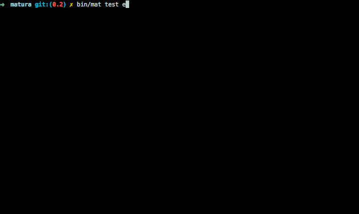

Matura
======

An RSpec / Mocha inspired testing tool for php. Requires 5.3+.

---

## Installation

1. `composer require "jacobstr/matura ~0.1"`

## Features

- [Esperance](http://github.com/jacobstr/esperance) expectation library: `expect($result)->to->have->length(2)`.
- A succinct DSL for defining tests.

		describe('Matura', function ($ctx){
			it('should make writing tests fun', function ($ctx) {
				expect($are_we_having_fun_yet)->to->eql(true);
			});
		});

- Heirarchical blocks to drill down from basic to complex assertions.

		describe('User', function ($ctx) {
			describe('Authorization', function ($ctx){
				describe('OAuth', function ($ctx) {});
			});
		});

- `before`, `before_all`, `after`, `after_all`, hooks with a well-defined ordering.

 		describe('User Database', function ($ctx) {
 			foreach(range(1,5) as $repetition) {
	 			it('should insert a user', function ($ctx){
	 				$user = $ctx->db->findOne(array(
	 					'username' => $ctx->username;
	 				));
	 				expect($user)->to->have->length(1);
	 			});

	 			it('should not accumulate users, function ($ctx){
	 				$users = $ctx->db->find();
	 				expect($users)->to->have->length(1);
	 			});
 			}

 			// Executed once for each describe block.
 			before_all(function ($ctx){
 				$ctx->test_id = uniqid();
 				$ctx->test_db = 'DB_'.$ctx->test_id;
 				$ctx->db = new Database('localhost', $ctx->test_db);
 			});

 			// Executed prior to each test (including descendants).
 			before(function ($ctx){
 			 	$ctx->username = 'test_user'.$ctx->test_id.uniqid();
 				$ctx->db->insert(array('username' => $ctx->username)); 
 			});

 			// Executed after each test (including descendants);
 			after(function ($ctx) {
 				$ctx->db->delete(array('username' => $ctx->username));
 			});

 			// Executed once at the very end of this describe block.
 			after_all(function ($ctx) {
 				$ctx->db->drop($ctx->test_db);
 			});

## The CLI

If you run, `bin/mat test test/examples`:

And the documentation for the standard test command:

	Usage:
	test [-g|--grep="..."] [-i|--include="..."] [-x|--exclude="..."] [-d|--trace_depth="..."] path

	Arguments:
	 path                  The path to the file or directory to test.

	Options:
	 --grep (-g)           Filter individual test cases by a description regexp.
	 --include (-i)        Include test files by a basename(filename) regexp.
	 --exclude (-x)        Exclude test files by a basename(filename) regexp.
	 --trace_depth (-d)    Set the depth of printed stack traces.
	 --help (-h)           Display this help message.
	 --quiet (-q)          Do not output any message.
	 --verbose (-v|vv|vvv) Increase the verbosity of messages: 1 for normal output, 2 for more verbose output and 3 for debug
	 --version (-V)        Display this application version.
	 --ansi                Force ANSI output.
	 --no-ansi             Disable ANSI output.
	 --no-interaction (-n) Do not ask any interactive question.

If you wish to filter specific tests within a suite/file, use `--grep`. Matura
will be clever enough to run the requisite before/after hooks - hopefully. We're
still fairly alpha ;)

## Test Organization

By default, Matura filters on the file's basename for anything beginning with `test_`.

I'm using the structure below. I might formalize this some time:

	├── test // Actual test cases.
	│   ├── functional // Functional tests.
	│   │   ├── test_context.php
	│   │   ├── test_model.php
	│   │   └── test_ordering.php
	│   ├── integration // More end-to-end flavored tests.
	│   │   └── test_test_runner.php
	│   └── performance // Tests that serve to benchmark your code.
	│       └── test_stress.php

I keep my fixtures in a top-level `support` folder. I've seen these placed in the
`test` folder but I chose to keep them tucked away to avoid iterating over them
and making the default filter complex.

## Authoring Tests

The one key piece is you want to place your tests in the `Matura\Tests` namespace
if you're not using PHP 5.6. If you're using 5.6 you can import the functions in
Matura\Tests into your namespace.

## Further Documentation

I swear it's not a cop out! Examine the [tests folder](test/functional).

* [In what order is everything run?](test/functional/test_ordering.php)
* [What is that $ctx parameter?](test/functional/test_context.php)

## TODOS

* There's currently nothing like PHPUnit's backupGlobals. Maybe there shouldn't
  be - I feel a better way to find inadvertent coupling / dependencies on global
  variables may be to add functionality that randomizes test ordering.
* Backtraces annoyingly include calls internal to the framework.
* I'm a fan of [contract tests](http://c2.com/cgi/wiki?AbstractTestCases).
  Class-based tests seem better suited to them, however, so I'm in need of
  inspiration wrt to the callback-driven dsl that matura uses. Maybe an invocable
  class...

## Thanks!

* [Ben Zittlau](https://github.com/benzittlau) - PHPUsable which brings similar
   syntax to PHPUnit. Helped me realize this was a worthwhile diversion.
